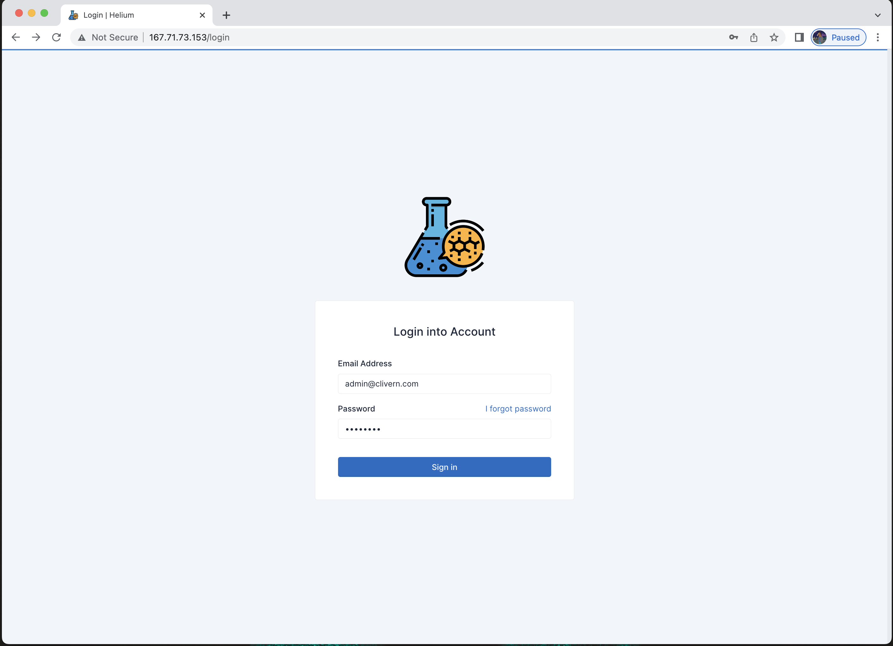
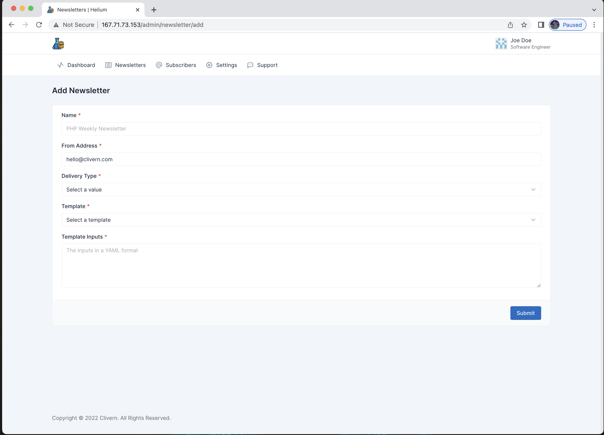

### Configuration

Once you have installed `Helium` on a server. Please follow the following steps setup the application and also send your first newsletter:

- Visit `Helium` URL and it will redirect to `/install` page. You will need to provide the application and admin data.

- Then you can login with the `Admin Email` and `Admin Password`.

- It is optional to update your profile. Inserting your first and last name.

- It is optional to update the settings.

- Then we need to add our first subscriber. Please use your personal email. You can either subscribe from the homepage like other users or insert the email manually from the dashhboard.

- Now we can send our first newsletter:

	- Open Newsletters then click `Add New` button.
	- Provide the newsletter name for example `PHP Weekly Newsletter`
	- Select delivery to be now or anytime in the future.
	- Select Template, the default values will show on template Inputs, you must change these values to your linking.
	- A button preview will show up once you update either the template or inputs to view the newsletter.
	- For more info how these template works, please check the [advanced](advanced.html) section.
	- Once you click submit with a delivery now, Helium will start sending emails immediately.

